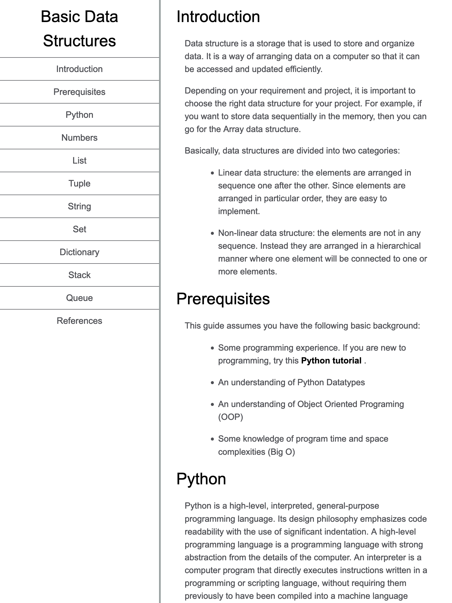
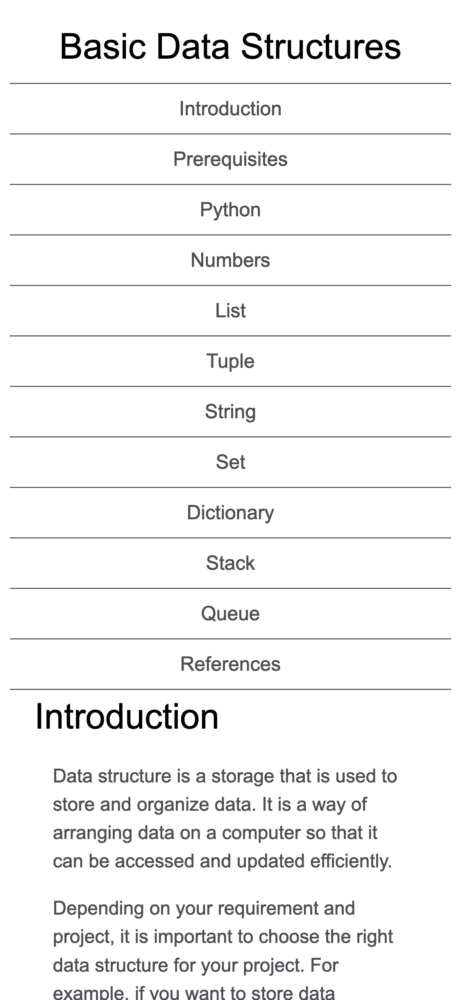

# Technical Documentation Project

This repository contains the HTML and CSS for the **Technical Documentation Page** project which is one of the required projects to earn the **Responsive Web Design** certification by [freeCodeCamp](https://www.freecodecamp.org/learn/2022/responsive-web-design/).

The goal of the project is to build a technical documentation page to serve as instruction or reference for a topic.

The `index.html` file contains HTML tags and appropriate classes and ids to use for structuring and manipulating the elements on the page.

The `css/styles.css` file is use in accord with best responsive (CSS Grid) and accesibility practices and tools to design and build a fully responsive technical documentation webpage.

The page can be viewed here: [Technical Documentation: Basic Data Structures](https://remicoding.github.io/technical-doc-project/)

For your convenience, here are screenshots of the page:

- Large screen webpage:
  

- Small screen webpage:
  
